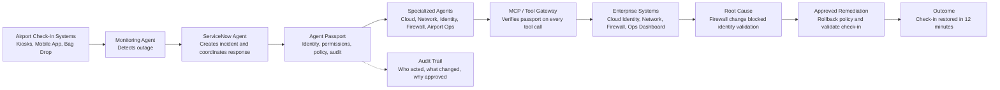

# Airline Check-In Outage Demo: Agent Passport System Design

## 1. Demo Summary

During a holiday travel surge, airport check-in kiosks, mobile check-in, and bag-drop counters begin failing because they cannot validate user identity tokens. A monitoring agent detects the outage and creates a critical ServiceNow incident.

Multiple AI agents collaborate to investigate and remediate the issue: ServiceNow, cloud, network, identity, firewall, and airport operations agents. Agent Passport acts as the trust and governance layer that verifies every agent before it can access systems, invoke another agent, or execute remediation.

The demo shows that Agent Passport makes autonomous multi-agent operations safe enough for enterprise production.

## 2. Business Problem

Airlines cannot allow unknown or ungoverned AI agents to touch mission-critical systems such as identity, firewall, network, and airport operations infrastructure.

Without Agent Passport, enterprise teams cannot easily answer:

- Which agent performed this action?
- Who owns the agent?
- Which user or system did the agent represent?
- Was the agent running in an approved runtime?
- Was it allowed to call this tool or invoke another agent?
- Was emergency remediation approved?
- Is there an auditable chain of decisions and actions?

The core product message is:

> Agent Passport provides trusted identity, delegation, policy enforcement, and auditability for enterprise AI agents.

## 3. High-Level Architecture



## 4. Identity Verification Model

Agent Passport uses certificate-backed workload identity to prove where an agent is running, then issues a short-lived signed passport that defines what the agent can do.

The recommended model has two layers:

```text
Workload certificate = proves the runtime and workload identity
Agent Passport token = proves the agent identity, permissions, delegation, and approval context
```

### 4.1 Workload Certificate

Each agent runs in an approved runtime such as AWS EKS, Azure Container Apps, GCP Cloud Run, Kubernetes, or an internal enterprise agent platform. The runtime provides a workload identity.

This can be represented by:

- X.509 certificate
- SPIFFE/SPIRE identity
- Kubernetes service account token
- AWS IAM role
- Azure managed identity
- GCP service account
- TPM-backed attestation

For the strongest enterprise story, use SPIFFE/SPIRE-style mTLS certificates.

Example workload identity:

```text
spiffe://airline.com/prod/agent/firewall-agent
```

When the agent calls Agent Passport, it connects over mTLS and presents its workload certificate.

Agent Passport verifies:

- Certificate is signed by a trusted CA
- Certificate is not expired
- Certificate has not been revoked
- SPIFFE ID or workload ID matches a registered agent runtime
- Runtime environment is approved for this incident type
- Agent workload is allowed to operate in production

This answers:

> Is this agent running from a trusted place?

### 4.2 Mapping Workload Identity To Agent Identity

The certificate proves the workload. Agent Passport maps that workload identity to a registered agent.

Example mapping:

```json
{
  "workload_id": "spiffe://airline.com/prod/agent/firewall-agent",
  "agent_id": "firewall-remediation-agent",
  "agent_version": "1.4.2",
  "owner": "network-ops",
  "environment": "prod",
  "trust_level": "production-remediation-approved"
}
```

This answers:

> Which registered agent is this?

### 4.3 Passport Token Issuance

After workload verification succeeds, Agent Passport issues a short-lived signed token. For a demo, a JWT is the simplest option. In production, this could also be a CWT, Verifiable Credential, or macaroon-style token with caveats.

Example signed passport:

```json
{
  "iss": "agent-passport.airline.com",
  "sub": "agent:firewall-remediation-agent",
  "agent_id": "firewall-remediation-agent",
  "agent_version": "1.4.2",
  "owner": "network-ops",
  "runtime": "spiffe://airline.com/prod/agent/firewall-agent",
  "delegated_by": "agent:servicenow-incident-agent",
  "incident_id": "INC-20491",
  "allowed_tools": [
    "firewall.policy.read",
    "firewall.policy.rollback"
  ],
  "approval_required": [
    "firewall.policy.rollback"
  ],
  "exp": 1760000000
}
```

This answers:

> What is this agent allowed to do right now?

### 4.4 Tool Gateway Verification

Every tool call goes through an MCP or tool gateway. The gateway verifies the signed passport before calling the enterprise system.

The gateway checks:

- Passport signature is valid
- Passport is not expired
- Issuer is trusted
- Agent identity is registered
- Requested tool is in `allowed_tools`
- Delegation chain is valid
- Incident context matches the request
- Risk policy allows the action
- Human approval exists if required

Example decision:

```text
Agent: firewall-remediation-agent
Requested tool: firewall.policy.rollback
Incident: INC-20491
Decision: Require approval
Reason: Production firewall change during Sev-1 incident
```

### 4.5 Certificate Versus Agent Passport

Certificates and passports solve different parts of the problem.

| Layer | Purpose | Example |
| --- | --- | --- |
| Certificate | Proves workload identity and trusted runtime | `spiffe://airline.com/prod/agent/firewall-agent` |
| Agent Passport | Proves agent permissions, delegation, context, and approval state | May call `firewall.policy.rollback` for `INC-20491` |

Simple analogy:

```text
Certificate: This process is running inside an approved production environment.
Agent Passport: This specific agent may perform this specific task under this specific incident.
```

## 5. Key Components

### Agent Passport

The central trust layer for all participating agents.

Responsibilities:

- Verify agent identity
- Verify agent owner and version
- Validate approved runtime environment
- Enforce tool-level permissions
- Enforce delegation rules between agents
- Calculate risk score for sensitive actions
- Require approval for high-risk remediation
- Record audit trail for every action

Example passport:

```json
{
  "agent_id": "firewall-remediation-agent",
  "agent_version": "1.4.2",
  "owner": "airline-network-ops",
  "delegated_by": "servicenow-incident-agent",
  "runtime": "aws-us-east-1-prod-eks",
  "expires_in": "5m",
  "allowed_tools": [
    "firewall.policy.read",
    "firewall.policy.rollback"
  ],
  "approval_required_for": [
    "production_firewall_change"
  ]
}
```

### MCP / Tool Gateway

The enforcement point between agents and enterprise systems.

Responsibilities:

- Require a valid Agent Passport for every tool call
- Verify token signature, expiration, issuer, and allowed tools
- Check delegation and incident context
- Call policy engine for risk decisions
- Block, allow, or request human approval
- Forward approved requests to enterprise systems
- Emit audit events for every decision

### Secrets Provider

Agent Passport should not store production secrets directly. It should authorize credential use, then integrate with a secrets provider such as 1Password, HashiCorp Vault, AWS Secrets Manager, Azure Key Vault, or GCP Secret Manager.

For the demo, 1Password can be positioned as the credential broker:

1. Agent Passport verifies the agent and approves the action.
2. The tool gateway requests a scoped credential from 1Password.
3. 1Password injects or releases the credential for the approved action.
4. The credential is not exposed broadly to the agent.
5. The credential access is logged.

This keeps the product story clean:

```text
Agent Passport = identity, policy, delegation, approval, audit
1Password = secret storage and credential brokering
```

### ServiceNow Agent

Coordinates the incident workflow.

Responsibilities:

- Create critical incident
- Search knowledge base
- Identify impacted business services
- Invoke approved specialized agents
- Correlate findings
- Submit emergency change request
- Update incident timeline

### Specialized Agents

These agents perform domain-specific investigation and remediation.

| Agent | Role | Example Access |
| --- | --- | --- |
| Cloud Agent | Checks cloud identity and API health | Read cloud service status, inspect logs |
| Network Agent | Checks routing, tunnels, and packet loss | Read network telemetry |
| Identity Agent | Checks token validation and IdP status | Read identity provider health |
| Firewall Agent | Checks and rolls back policy changes | Read firewall policy, rollback approved changes |
| Airport Ops Agent | Confirms business impact | Read airport operations dashboard |

## 6. Demo Flow

1. Airport check-in systems begin failing before peak holiday traffic.
2. Monitoring Agent detects timeout spikes and failed identity validation.
3. Monitoring Agent presents its workload certificate to Agent Passport.
4. Agent Passport verifies the certificate and issues a short-lived passport.
5. Monitoring Agent creates a ServiceNow incident through the tool gateway.
6. ServiceNow Agent presents its certificate and receives its own passport.
7. ServiceNow Agent invokes Cloud, Network, Identity, Firewall, and Airport Ops agents.
8. Agent Passport verifies each agent before allowing access or delegation.
9. Agents discover that a firewall policy update blocked token validation traffic.
10. Firewall Agent proposes a rollback.
11. Agent Passport calculates risk and requires emergency approval.
12. Approved rollback is executed with a scoped credential from the secrets provider.
13. Synthetic check-in test confirms recovery.
14. ServiceNow incident is updated with root cause, remediation, and audit trail.

## 7. Policy Enforcement Example

When the Firewall Agent attempts to roll back a production policy, Agent Passport checks:

- Is this agent identity valid?
- Is the agent version approved?
- Is the agent running in a trusted runtime?
- Is `firewall.policy.rollback` allowed?
- Was this action delegated by an authorized ServiceNow Agent?
- Is this a Sev-1 incident?
- Has emergency approval been granted?
- Is a rollback plan available?

If all checks pass, the action is allowed and logged. If any check fails, Agent Passport blocks the action or requires human approval.

## 8. Risk Scoring

Agent Passport assigns a risk score to each tool call.

| Signal | Example | Risk Impact |
| --- | --- | --- |
| Sensitive action | Firewall policy rollback | High |
| Production system | Airport check-in production network | High |
| Unknown runtime | Agent running outside approved cloud | High |
| New delegation path | ServiceNow Agent invoking new Firewall Agent | Medium |
| Prior approved workflow | Known emergency rollback workflow | Lowers risk |

Example outcome:

```text
Requested action: firewall.policy.rollback
Risk score: 82/100
Decision: Require emergency approval
Reason: Production firewall change during Sev-1 incident
```

## 9. Audit Trail

Agent Passport records a complete chain of responsibility:

```text
Monitoring Agent
  -> created ServiceNow incident INC-20491

ServiceNow Agent
  -> invoked Cloud Agent, Network Agent, Identity Agent, Firewall Agent

Firewall Agent
  -> proposed rollback of firewall policy FW-7781

Change Approval
  -> approved emergency rollback for Sev-1 incident

Firewall Agent
  -> executed rollback

ServiceNow Agent
  -> validated check-in recovery and closed incident
```

This audit trail is the enterprise buyer's proof that autonomous remediation was controlled, authorized, and compliant.

## 10. Demo Screens

Recommended demo screens:

1. **Incident View**
   - ServiceNow incident created automatically
   - Business impact: airport check-in unavailable
   - Severity: Sev-1

2. **Agent Passport Verification View**
   - Agent identity
   - Owner
   - Runtime
   - Permissions
   - Delegation chain

3. **Agent Collaboration View**
   - ServiceNow Agent coordinating specialized agents
   - Each agent returns evidence
   - Root cause correlation shown

4. **Risk Approval View**
   - Firewall rollback request
   - Risk score
   - Reason for approval requirement
   - Approve or reject action

5. **Audit Timeline View**
   - Every agent action
   - Every tool call
   - Every approval
   - Final business outcome

## 11. Success Metrics

| Metric | Demo Value |
| --- | --- |
| Detection time | Under 1 minute |
| Incident creation | Automatic |
| Root cause identification | Under 8 minutes |
| Remediation time | Under 12 minutes |
| Human approval points | Only high-risk production change |
| Audit coverage | 100% of agent actions |

## 12. Selling Message

The outage story sells the value of multi-agent automation. Agent Passport sells why enterprises can actually trust it.

Without Agent Passport:

- Agents are powerful but risky
- Permissions are unclear
- Agent-to-agent delegation is hard to govern
- Audit trails are fragmented
- Security teams will block production deployment

With Agent Passport:

- Every agent has verified identity
- Every action is policy-controlled
- Every delegation is explicit
- Every sensitive operation can require approval
- Every decision and tool call is auditable

## 13. Tagline

**Agent Passport: trusted identity, access control, and auditability for the agent economy.**
